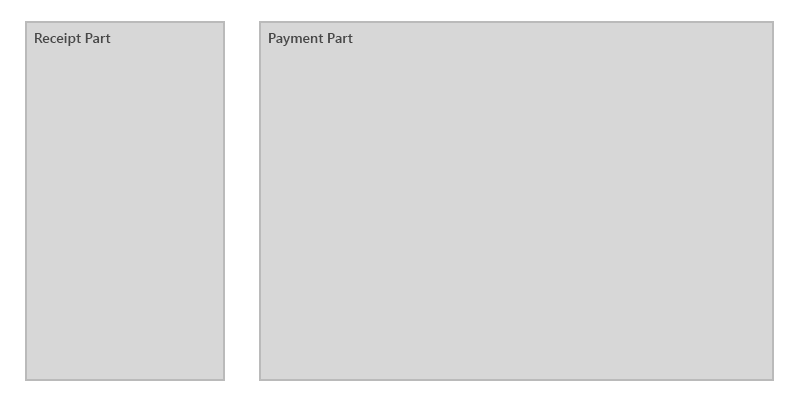
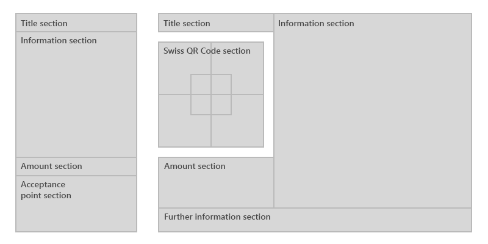

# How to Create a Custom DevExpress Report Control - Swiss QR Bill Implementation

This article documents how we built a custom DevExpress Report control (Swiss QR-Bill Reporting component) and how we addressed issues encountered during development. We hope this information will be of value for those who wish to create their own custom DevExpress Report control.

To help demystify the report control development process, this article describes how to create design-time settings, serialize the designer component and related “bricks,” and render a component for print and export.  

The first section contains general information on the Swiss QR Bill control and describes the requirements for the control itself. The second section details component implementation.

## General Information

The Swiss QR Bill is a new payment slip form featuring QR code. Swiss QR Bill consists of the following elements: 

* receipt;
* payment part;
* barcode.

The invoice may use one of the following layouts: 

* "Full" invoice printed on an A4 sheet;
* "Short" invoice printed on an A6 sheet;
* Invoice for continuous printing;
* Invoice for printing on individual pages.

A "full" invoice contains a receipt whereas a "short" invoice only contains payment info. The component’s **BillKind** property specifies the **PaymentAndReceipt** value for the full invoice and the **PaymentOnly** value for the short invoice. Continuous or individual printing is specified with the **IntegratedMode** property.

Invoices are printed (or exported to PDF) on A4 or A6 paper, with a perforation line specified via **BillOption.PreviewSeparatorKind** and **BillOption.PdfSeparatorKind** properties, respectively. The component allows you to change the language and font for any field. The **StringData** property can be used to bind the field to an external data source. 

## Report Control Development – An Overview 

To create a new report control, you must:

1. Choose a base class. If you cannot find a suitable control to derive from, inherit a component from the **XRControl** class.

2. Create the component's object model. Specify a set of properties and related attributes that determine how  properties are serialized and displayed in the Property grid.

3. Create component designers for Visual Studio and the End User Designer. Designers determine the component's appearance and behavior at design time. Add attributes as necessary.

4. Choose the base class for the component's “brick.” An obvious choice is the brick that the base class creates. However, if the component inherits from the **XRControl** class, there are two options - select **VisualBrick** as the brick's base class if you require a simple brick or **PanelBrick** if you need a container. 

5. Specify how the component creates its "brick" and map the component's properties to the brick's characteristics.

6. Implement the **BrickExporter** class to render the "brick". Override the methods used for drawing and export.

The following sections detail how we built the SwissQRBill component in greater detail.

## Component Implementation

Since the SwissQRBill component is an XRControl descendant, it has its own "brick", serialization and an item in the designer's toolbox.

### Design time

To add a component to the Visual Studio Toolbox, the component must have the a **ToolBoxItem(true)** attribute. 

The WinForms End-User Designer requires that the component is registered with the **IToolBoxService**. Handle the **DesignPanelLoaded** event and call the **IToolBoxService.AddToolBoxItem** method to register the component.

To implement design-time functionality for the component, add the **Designer** and **XRDesigner** attributes for Visual Studio and the WinForms End-User Designer, respectively. The control's resize rules and smart tag items must be modified as needed. Smart tag items are specified with the **DesignerActionList** objects registered in the Component Designer. The **GetSelectionRulesCore** method modifies the control’s resize rules. Review the code in the following file for more information: [XRSwissQRBillDesignerActionList.cs](DevExpress.XtraReports.CustomControls.Design/XRSwissQRBillDesignerActionList.cs).

When you set up the property grid, pay close attention to expandable objects. In this example, the **ExpandableObjectConverter** descendants are created to override the **ConvertTo** method. The new **ConvertTo** method implementation changes the string displayed in the property grid editor.  The **GetProperties** method of the **AddressTypeConverter** removes properties which are not necessary for this address type. Review the code in the following file for more information: [TypeConverters.cs](DevExpress.XtraReports.CustomControls/SwissQRBill/TypeConverters.cs)

## "Brick" Implementation

### General Concepts

[VisualBrick](https://docs.devexpress.com/CoreLibraries/DevExpress.XtraPrinting.VisualBrick) is a basic element used to display data. The VisualBrick element consists of a data model (the brick) and its presentation (the exporter).

The exporter renders the "brick" and exports it to different formats. The exporter is specified with the **BrickExporter(Type)** attribute set for the "brick". In this example, we use the **PanelBrickExporter** and **VisualBrickExporter** descendants as exporters. The Draw methods are overridden to implement rendering. The Brick field is used to obtain access to the "brick".

To create a "brick", override the **CreateBrick(VisualBrick[] childrenBricks)** method and return the "brick" instance. The **PutStateToBrick(VisualBrick brick, PrintingSystemBase ps)** method maps control properties to "brick" data. Review the code in the following file for more information: [XRSwissQRBill.cs](DevExpress.XtraReports.CustomControls/SwissQRBill/XRSwissQRBill.cs).

### The Choice of Base Class

Swiss QR Control layout is an area with text elements and a barcode in the middle. The primary choices for a base class are a panel, a table, and a text "brick". The panel "brick" can arrange the components inside via its simple structure. For this reason, **SwissQRBillBrick** is based on the **PanelBrick** class, and the exporter is based on the **PanelBrickExporter** class.

### Service Brick Implementation

The specification states that the payment portion may contain empty areas marked with corners. To meet this requirement, we created an additional **CornerRectangleBrick** and its exporter – the **CornerRectangleBrickExporter** - which is responsible for drawing corners. This "brick" includes a **BrickType** property - which is overridden to implement correct deserialization.

### Layout Implementation

 Choose **PanelBrick** as the base class. You can use the **Bricks** property to access its inner "bricks". Inner “brick” coordinates are set relative to the coordinates of the panel itself - relative to point (0, 0). 

Split the component into _Receipt_ and _Payment Part_ regions. 

Rendering functions return other "bricks" (or "brick" combinations) that are subsequently added to the Bricks collection.

* CreateReceiptPart()
* CreatePaymentPart()

We must now have to render sub-regions, as shown in the image below. 

1. CreateReceiptTitle()
2. CreateReceiptInformation()
3. CreateReceiptAmount()
4. CreateReceiptAcceptancePoint()
5. CreatePaymentTitle()
6. CreatePaymentSwissQRCode()
7. CreatePaymentAmount()
8. CreatePaymentInformation()
9. CreatePaymentFurtherInformation()

Review the code in the following file for more information: [SwissQRBillBrick.cs](DevExpress.XtraReports.CustomControls/SwissQRBill/SwissQRBillBrick.cs).

### Exporter Implementation

The exporter draws adorners on top of the finished "brick". This allows us to change the appearance in a preview or in an exported PDF file. In this example, the exporter draws perforation lines and additional text. The brick’s **SeparatorKind** option determines what to draw. The same mechanism for drawing a "brick" is used for preview and during PDF export. The main difference is that **IGraphics** passed to the exporter's Draw method is an object with the **IPdfGraphics** interface.

## Serialization

### General Concepts

Both the control and the "brick" require serialization. The "brick" only uses xml serialization, and the control implements xml serialization and supports CodeDom serialization - which is mandatory for the Visual Studio Designer.

## Control Serialization

The **XtraSerializableProperty** attribute is responsible for serializing the property in xml. Only specify the attribute to serialize a property that returns a simple type. Complex types require a constructor with a **XtraSerializationVisibility** argument type (the most frequently used values are **Hidden**, **Collection**, **Reference**, **Content**).

The **DesignerSerializationVisibility** attribute is responsible for the CodeDOM serialization in the Visual Studio Designer. It has only three variants of the related enum - **Hidden**, **Visible** and **Content**. Mark collections or references with a **Visible** attribute value.

The **DefaultValue** attribute determines whether the property value is included in serialization.

### Brick Serialization

Only XML serialization is necessary. For correct deserialization, map the "brick’s" text type (the overridden **BrickType** property at the Brick level) to the real type. The **BrickFactory.BrickResolve** method is used for mapping. For an
implementation of the **BrickResolve** method, review the code in the following file: [CustomControl.cs](DevExpress.XtraReports.CustomControls/CustomControl.cs)

## Component Use

To use the component in the Visual Studio Designer, add it to the Visual Studio Toolbox.

To use the component in the End-User Designer, call the **AddSwissQRControlToToolBox** method with the **XRDesignMdiController** passed as an argument. Review the code in the following file for more information: [CustomControlToolBoxRegistrator.cs](DevExpress.XtraReports.CustomControls.Design/CustomControlToolBoxRegistrator.cs).

## Conclusion

You have now created your own custom reporting component. If you have technical questions on this subject, please feel free to contact our support team via the DevExpress [Support Center](https://supportcenter.devexpress.com/).