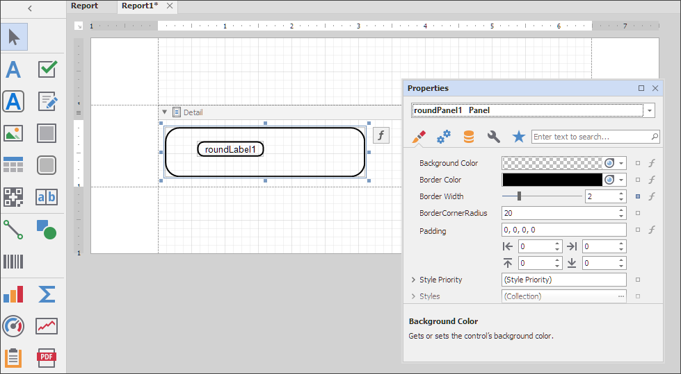

# How to Create a Custom DevExpress Report Control - Controls with Rounded Corners

This example demonstrates two custom controls. They have custom "brick" and "brick" exporter classes.

## Label with Rounded Corners
| | Control | Brick | Brick Exporter |
| --- | --- | --- | --- |
| Class | [XRRoundLabel](Label/XRRoundLabel.cs) | [RoundLabelBrick](Label/RoundLabelBrick.cs) | [RoundLabelBrickExporter](Label/RoundLabelBrickExporter.cs) |
| Base Class | [XRLabel](https://docs.devexpress.com/XtraReports/DevExpress.XtraReports.UI.XRLabel) | [LabelBrick](https://docs.devexpress.com/CoreLibraries/DevExpress.XtraPrinting.LabelBrick) | `LabelBrickExporter` |

## Panel with Rounded Corners

| | Control | Brick | Brick Exporter |
| --- | --- | --- | --- |
| Class | [XRRoundPanel](Panel/XRRoundPanel.cs) | [RoundPanelBrick](Panel/RoundPanelBrick.cs) | [RoundLabelBrickExporter](Panel/RoundPanelBrickExporter.cs)
| Base Class | [XRPanel](https://docs.devexpress.com/XtraReports/DevExpress.XtraReports.UI.XRPanel) | [PanelBrick](https://docs.devexpress.com/CoreLibraries/DevExpress.XtraPrinting.PanelBrick) | `PanelBrickExporter` |

## Implementation

To add a component to the Visual Studio Toolbox, the component must have the a **ToolBoxItem(true)** attribute. 

Design-time functionality is inherited from the base controls.

### "Brick"

The [VisualBrick](https://docs.devexpress.com/CoreLibraries/DevExpress.XtraPrinting.VisualBrick) is a basic element used to display data. The VisualBrick element consists of a data model (the brick) and its presentation (the exporter).

The exporter renders the "brick" and exports it to different formats. The exporter is specified with the **BrickExporter(Type)** attribute set for the "brick". In this example, we use the `LabelBrickExporter` and `PanelBrickExporter` descendants as exporters. The `DrawBackground` methods are overridden to implement rendering. The `RoundedBrick` property is used to obtain access to the "brick".

## Serialization

### General Concepts

Both the control and the "brick" require serialization. The "brick" only uses xml serialization, and the control implements xml serialization and supports CodeDom serialization - which is mandatory for the Visual Studio Designer.

### Control Serialization

The `XtraSerializableProperty` attribute is responsible for serializing the property in xml. Specify the attribute to serialize a property that returns a simple type. Complex types require a constructor with a `XtraSerializationVisibility` argument type. The most frequently used values are the following:  **Hidden**, **Collection**, **Reference**, and **Content**.

The **DefaultValue** attribute determines whether the property value is included in serialization.

### Brick Serialization

Only XML serialization is necessary. For correct deserialization, map the "brick’s" text type (the overridden `BrickType` property at the Brick level) to the real type. The `BrickFactory.BrickResolve` method is used for mapping. For an
implementation of the `BrickResolve` method, review the code in the following file: [RoundedCustomControl.cs](../DevExpress.XtraReports.CustomControls.RoundedControls/RoundedCustomControl.cs).

## Toolbox

To use the component in the Visual Studio Designer, add it to the Visual Studio Toolbox.

To use the component in the End-User Designer, call the `AddRoundedLabelToToolBox` and `AddRoundedPanelToToolBox` methods with the [XRDesignMdiController](https://docs.devexpress.com/XtraReports/DevExpress.XtraReports.UserDesigner.XRDesignMdiController) instance passed as an argument. Review the code in the following file for more information: [CustomControlToolBoxRegistrator.cs](../DevExpress.XtraReports.CustomControls.Design/CustomControlToolBoxRegistrator.cs).

## Result

When you run this project, the `XRRoundLabel` and `XRRoundPanel` controls are available in the Toolbox. You can drag-and-drop them to the design area:

